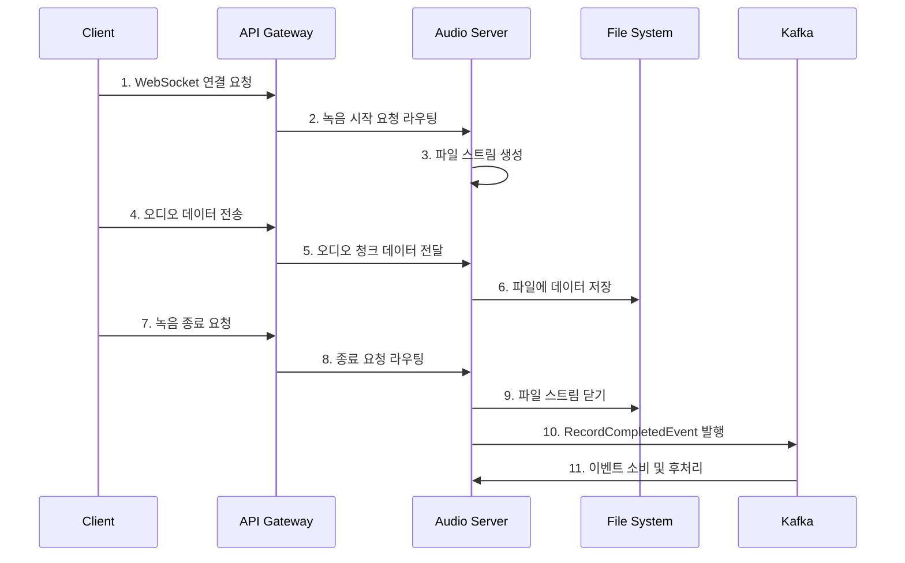

# 🎧 Microservices Architecture Example (Spring Cloud, Monorepo)

이 프로젝트는 **Spring Cloud 기반의 모노레포(Monorepo) 마이크로서비스 아키텍처** 예제입니다.  
도메인 기능(오디오 녹음, 파일관리)을 **MSA 구조**로 분리하고,  
**이벤트 기반 아키텍처(Kafka), 서비스 디스커버리(Eureka), API Gateway** 등 다양한 구조를 구현합니다.

단순 예제로 상세 로직은 구현이 필요합니다.

```

프로젝트 실행 후 확인 가능
음성생성
 - http://localhost:5000/websocket-test.html
저장 목록
 - http://localhost:5000/file-list.html
 
```
---

## 🧩 주요 구성 요소

- **API Gateway**
  - 클라이언트의 모든 요청을 받아 각 마이크로서비스로 라우팅
  - WebSocket 연결 지원, 라우팅/로드밸런싱 구현

- **Eureka Server**
  - 서비스 디스커버리 및 레지스트리(서비스 등록/검색/헬스체크)

- **Audio Server**
  - 오디오 녹음/파일 관리 담당
  - 녹음 시작/종료, 파일 목록/다운로드 API 제공

- **Kafka (with Kafdrop/Kafka UI)**
  - 서비스 간 비동기 메시지/이벤트 통신
  - 이벤트 발행/소비자 구조, 모니터링 도구 포함

- **공통 Core 모듈**
  - `core-common`: 프레임워크 독립 유틸리티
  - `core-web`: Spring Web 공통 기능(AOP, WebClient, 예외처리 등)
  - `kafka-core`: Kafka 이벤트 처리 공통 모듈

---

## 💡 아키텍처 특징

- **모노레포(Monorepo) 멀티모듈 구조**  
  여러 마이크로서비스 및 공통 모듈을 하나의 저장소에서 효율적으로 관리

- **모듈화/재사용성**  
  공통 기능(Core)과 서비스별 독립성 모두 확보

- **이벤트 기반 아키텍처**  
  Kafka를 통한 비동기 통신/느슨한 결합/확장성 강화

- **서비스 디스커버리/로드밸런싱**  
  Eureka 기반 동적 확장/장애 대응 구조

- **운영 편의성**  
  Docker Compose 기반 Kafka 클러스터 & Kafdrop/Kafka UI 제공

---

## 🚀 빠른 시작/실행 가이드

**실행/설치 및 자세한 안내는 [실행 가이드(RUNNING.md)](./RUNNING.md) 문서를 참고하세요.**

- 전체 서비스, 모듈, 의존성 설치/실행 방법, 순서 등을 정리

---


## 🔄 오디오 처리 흐름과 이벤트 기반 아키텍처

이 프로젝트는 **이벤트 기반 아키텍처(Event-Driven Architecture)**를 통해 마이크로서비스 간 느슨한 결합과 확장성을 구현합니다.

### 📝 오디오 녹음 및 파일 저장 프로세스



### 🔄 이벤트 기반 처리 흐름

1. **녹음 시작 (Start)**
  - 클라이언트가 WebSocket을 통해 녹음 시작 요청
  - `RecordService`가 파일 스트림 생성 및 세션 관리 시작

2. **데이터 저장 (Save Chunk)**
  - Base64로 인코딩된 오디오 데이터를 수신
  - 디코딩 후 파일 스트림에 청크 단위로 저장

3. **녹음 종료 (End)**
  - 파일 스트림 종료 및 리소스 정리
  - `RecordCompletedEvent` 생성 및 Kafka로 발행
   ```java
   RecordCompletedEvent event = new RecordCompletedEvent(
       sessionId, metaId, filePath, fileName, LocalDateTime.now()
   );
   eventPublisher.publish(event, sessionId);
   ```

4. **이벤트 소비 (Consume)**
  - `RecordCompletedConsumer`가 이벤트 수신
  - 파일 후처리, 메타데이터 저장, 추가 비즈니스 로직 실행
   ```java
   @KafkaListener(topics = "audio.record.completed", groupId = "audio-service")
   public void consume(RecordCompletedEvent event) {
       // 파일 후처리 로직 실행
   }
   ```

### 💡 이벤트 기반 아키텍처의 장점

- **확장성**: 새로운 소비자 서비스 추가만으로 기능 확장 가능
- **느슨한 결합**: 서비스 간 직접 의존성 없이 이벤트로 통신
- **장애 격리**: 한 서비스의 장애가 전체 시스템에 영향 최소화
- **비동기 처리**: 시간이 오래 걸리는 작업을 비동기적으로 처리

### 📊 모니터링 및 관리

- **Kafdrop/Kafka UI**를 통해 이벤트 흐름 실시간 모니터링
- 토픽, 파티션, 컨슈머 그룹 상태 확인 및 관리
- 이벤트 발행/소비 지연 및 오류 감지

이 아키텍처를 통해 오디오 파일 생성 후 자동으로 후속 처리가 이루어지며, 시스템 확장 시 기존 코드 수정 없이 새로운 이벤트 소비자만 추가하면 됩니다.